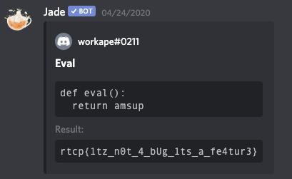

# PWN Challenges

## Adventure-Revisited

>>--- CTF Text ---
>>Let's go on an adventure!
>>The solution is in there... somewhere.
>>
>>(#adventure-revisited on discord)
>>------
There’s a hint attached to the system that reveals this:

Looks like there’s an open eval of some language, I was guessing JS or Python right out of the game.  The bot likes to tell a story that quickly becomes nonsensical:

Asking the bot for help reveals this:

No eval in there, and asking it to execute an eval you get this:

Which means that it’s context aware, so we need to pull it into a different Discord context.  Luckily there is an invite link allowing you to invite the bot into your channel in the help statement above.  Once Jade had joined me in my channel, then began the learning about the capabilities.  Did some quick checks against it to see if it was taking input and eval’ing it at a shell:

The return there really pointed me at JS or Python, but the function structure screamed Python.  So we checked for some quick and easy things based on the story itself that was being produced back in the main channel:

They disabled external imports, so it looks like the data is contained within the bot, I think.

Looks like it wasn’t going to be easy, so I began to wonder about the variables that were loaded which got me thinking about the dir(), locals(), and globals()  (https://thepythonguru.com/python-builtin-functions/locals/ -- quick read for anyone wondering what these are!) and what they contained.  From testing, locals() and globals() were the same, so we went to looking at them in context:

Interesting, looks like a lot of just randomized garbage for keys, but the values are all [HIDDEN].  Just to make sure that this wasn’t some artifact of code manipulating the data, I addressed one of the elements directly.

Still [HIDDEN], so the question was, how many variables are there since Discord is truncating the results there.

Oh good grief...ok, so we’ll need to figure out something unique about the answers.  So, then the question became, which ones DON’T have a value of [HIDDEN]?  Time to get ridiculous with some conditional list comprehension, because what could be more insanely pythonic?

Oh my, look at that!  The magical rtcp!  Wait, where was that again?

This time I grabbed both the key and the data, and it looks like the variable named amsup holds the rtcp{} that we are looking for!

Got it :)
